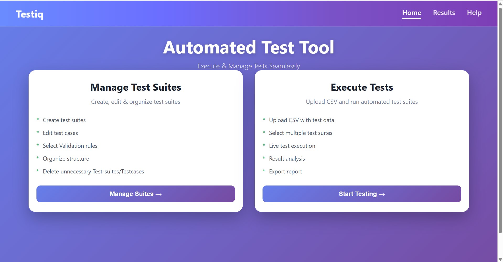
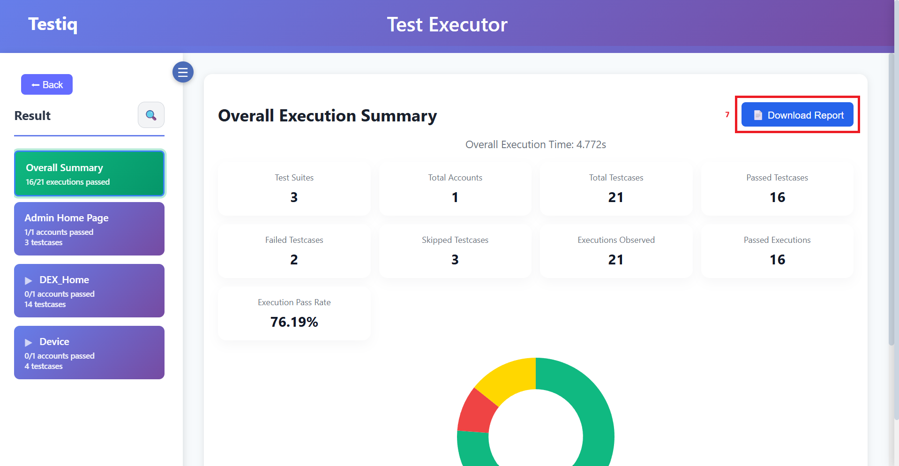

# Testiq

Testiq is an automated testing platform designed to execute and analyze predefined test cases across web-based systems and API-driven applications. 


It enables testers to upload account or session data through a CSV (Comma Separated Values) file, execute selected test suites, monitor execution activity, analyze results, generate downloadable reports, and manage testsuites.

---

## Features

- CSV-driven multi-account testing
- Configurable test suites
- JSON Path-based validation
- Live execution logs
- Result summary with PDF export

---

## System Requirements

- Java 21 or above
- Minimum 4GB RAM recommended
- Supported OS: Windows, Linux, macOS
- Default Port: 8080

Verify Java installation:
`java -version`


---

## Installation

### 1. Download

Download the distribution package:

 - Testiq v1.0.0 :  [`Testiq.zip`](https://github.com/JESINTHASHARON/Testiq/releases/download/v1.0.0/Testiq.zip)


### 2. Run Application

#### Windows

Option 1:Double-click start.bat

Option 2: run `java -jar testiq-0.0.1-SNAPSHOT.jar`


#### Linux / macOS

→ unzip Testiq.zip

→  cd Testiq

→ run `java -jar testiq-0.0.1-SNAPSHOT.jar`


---

## Access Application

Open your browser and visit:

[http://localhost:8080/](http://localhost:8080/)


---

## Basic Usage

### Test Management
1. Navigate to **Execute Tests**
2. Add/Update/Delete/View Testcases, Testsuites, Prechecks
3. Select a test case to validate user accounts
4. Arrange the order of test cases and test suites for execution
### Test Execution
1. Navigate to **Execute Tests**
2. Upload a CSV file
3. Select one or more test suites
4. Click **Run Tests**
5. Review results and download report


CSV Upload →
Data Validation → Test Suite Execution → JSON Path Validation → Result Aggregation → PDF Report Generation

### CSV Format

Headers must match exactly:

accountName,baseUrl,cookie,...

Each row represents one account/session.

---

## Development Setup (For Contributors)

This section is intended for developers who want to modify the source code and contribute to Testiq.


### Clone the Repository

```bash
git clone https://github.com/JESINTHASHARON/testiq.git
cd testiq
```
### Prerequisites

- Java 21 or above

- Maven 3.8+

- Minimum 4GB RAM recommended

- IDE (IntelliJ IDEA / VS Code / Eclipse)

Verify installation:

`java -version`

`mvn -version`

### Import into IDE

- Open your preferred IDE

- Select Open Project

- Choose the root project directory

- Import as a Maven Project

- Allow dependencies to download

### Run in Development mode

Option 1: Run the main class annotated with @SpringBootApplication.

Option 2: Using Maven `mvn spring-boot:run`

The application will start at:   http://localhost:8080

Build After Making Changes: `mvn clean package`

Generated artifact:  `target/testiq-0.0.1-SNAPSHOT.jar`


---

## Screenshots

### Dashboard



---

### Test Execution


---

### Test Management


---

### Result Summary & Report



---

## Documentation

The complete user guide is available in the corresponding GitHub Release.

Latest Stable Version: **v1.0.0**

[Download Documentation](https://github.com/JESINTHASHARON/Testiq/releases/download/v1.0.0/Testiq.Doc.pdf)

---
## Version

1.0.0 — Initial Stable Release


